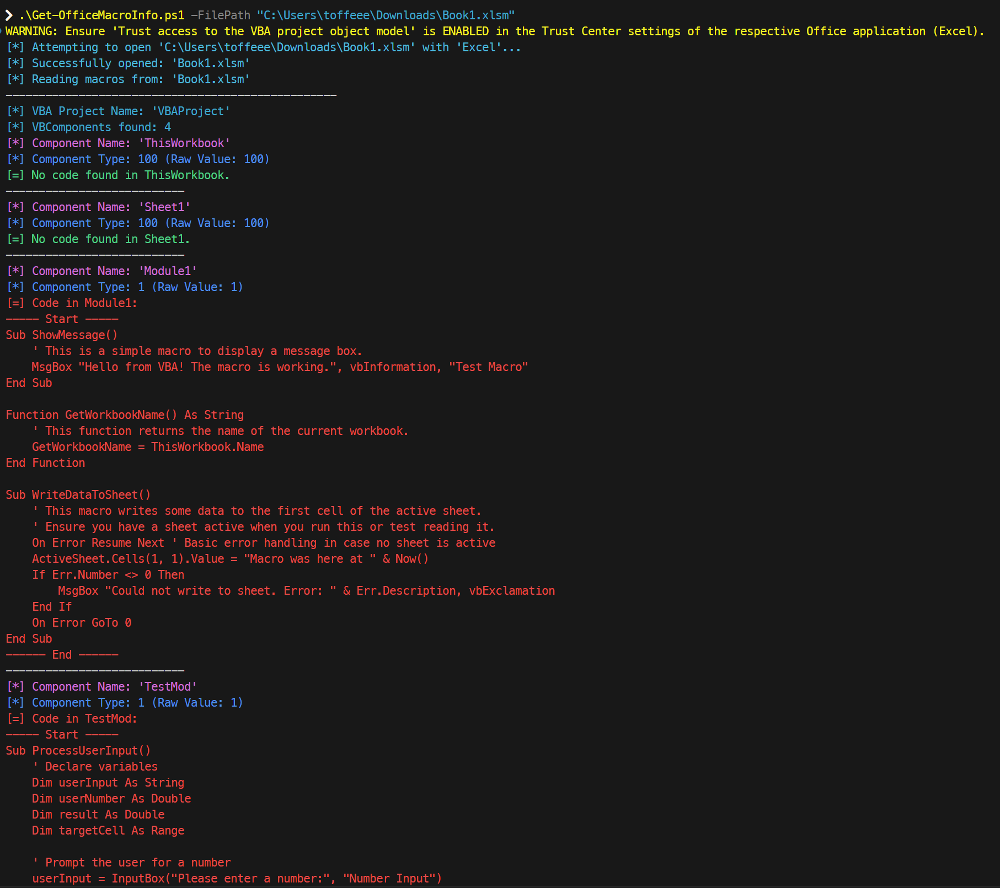
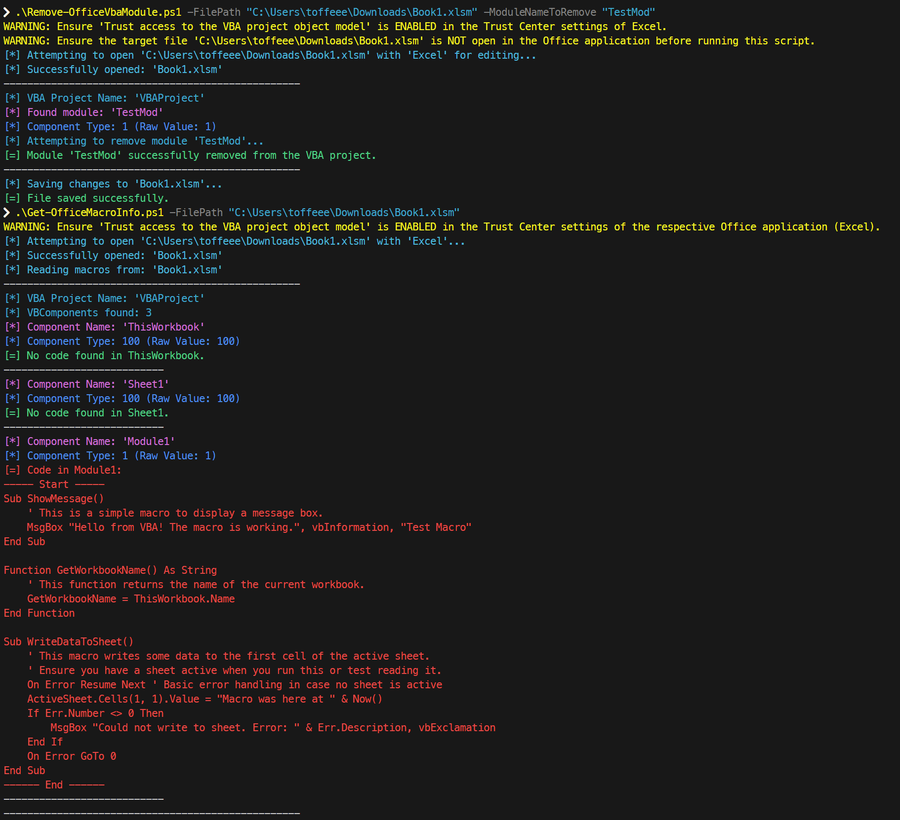

# MSOffice VBA Management PowerShell Scripts 

This repository contains PowerShell scripts designed to help manage VBA (Visual Basic for Applications) projects within Microsoft Office files (Excel, Word, PowerPoint). You can inspect VBA macro code and remove specific VBA modules programmatically.

## Features

* **Inspect VBA Macros**: View the names, types, and code content of all VBA components within a specified Office file.
* **Remove VBA Modules**: Programmatically delete specific VBA modules (e.g., standard modules, class modules) from an Office file.
* **Cross-Application Support**: Works with:
    * Excel: `.xlsm`, `.xls`
    * Word: `.docm`, `.dotm`
    * PowerPoint: `.pptm`, `.ppsm`

## Scripts

1.  **`Get-OfficeMacroInfo.ps1`**: Reads and displays information about VBA components and their code from an Office file.
2.  **`Remove-OfficeVbaModule.ps1`**: Removes a specified VBA module from an Office file.

## Prerequisites

1.  **Windows PowerShell**: These scripts are designed for PowerShell (typically version 5.1 or later).
2.  **Microsoft Office Installed**: The relevant Microsoft Office application (Excel, Word, or PowerPoint) must be installed on the machine where the script is run. The scripts use COM automation to interact with the Office applications.
3.  **"Trust access to the VBA project object model"**: This setting **MUST BE ENABLED** in the Trust Center for each Office application you intend to use with these scripts.
    * To enable:
        1.  Open the Office application (e.g., Excel).
        2.  Go to `File > Options > Trust Center > Trust Center Settings...`.
        3.  Select `Macro Settings`.
        4.  Under "Developer Macro Settings", check the box for **"Trust access to the VBA project object model"**.
        5.  Click `OK` to close the dialogs.
        6.  Repeat for Word and PowerPoint if you plan to use the scripts with those file types.

## Usage

### `Get-OfficeMacroInfo.ps1`

This script inspects an Office file and outputs details about its VBA project, including components and their code.

**Parameters:**

* `-FilePath <string>`: (Mandatory) The full path to the Office file you want to inspect.
* `-EnableTrustAccess`: (Switch) If specified, the script will attempt to automatically enable the "Trust access to the VBA project object model" registry setting for the current user and Office version. It will attempt to revert this change in the `finally` block. **Note:** Office applications must be restarted for this registry change to take full effect on the running application instance.


**Example:**

```powershell
.\Get-OfficeMacroInfo.ps1 -FilePath "C:\Path\To\Your\Workbook.xlsm"
```powershell
.\Get-OfficeMacroInfo.ps1 -FilePath "C:\Path\To\Your\Document.docm -EnableTrustAccess"
```powershell
.\Get-OfficeMacroInfo.ps1 -FilePath "C:\Path\To\Your\Presentation.pptm -EnableTrustAccess"
```

### `Remove-OfficeVbaModule.ps1`

This script removes a specified VBA module from an Office file.

**Parameters:**

* `-FilePath <string>`: (Mandatory) The full path to the Office file.
* `-ModuleNameToRemove <string>`: (Mandatory) The name of the VBA module you want to remove (e.g., "Module1", "MyCustomClass").

**Important Before Running `Remove-OfficeVbaModule.ps1`:**

* **BACK UP YOUR FILES!** This script modifies files. Always have a backup before running it.
* **Ensure the target Office file is CLOSED.** The script cannot reliably modify a file that is currently open in its respective Office application.

**Example:**

```powershell
.\Remove-OfficeVbaModule.ps1 -FilePath "C:\Path\To\Your\Workbook.xlsm" -ModuleNameToRemove "Module1"
```powershell
.\Remove-OfficeVbaModule.ps1 -FilePath "C:\Path\To\Your\Document.docm" -ModuleNameToRemove "ObsoleteCodeModule"
```

## Important Considerations & Limitations

* **Security**: Enabling "Trust access to the VBA project object model" lowers a specific security barrier. Understand the implications in your environment. Consider disabling it when not actively using these scripts if security is a major concern.
* **File Access**: Ensure the PowerShell script has the necessary read/write permissions for the files and directories it's interacting with.
* **Error Handling**: The scripts include basic error handling, but COM automation can sometimes be sensitive. If you encounter persistent issues, check that the Office application itself is functioning correctly and that the file isn't corrupted or locked.
* **Document Modules**: `Remove-OfficeVbaModule.ps1` can only remove VBA components that are not "Document" type (VBA component type 100). This means it is suitable for standard modules, class modules, and user forms. However, it **cannot** remove document modules like `ThisWorkbook`, `Sheet1` (Excel), or `ThisDocument` (Word), as these are intrinsic to the file structure. To remove code from such document modules, you would need to modify the script to clear their `CodeModule` content instead of removing the component itself.
* **Office Application State**: The scripts create and quit instances of Office applications in the background. If an Office application hangs or doesn't quit properly, you might need to manually close it via Task Manager.

## Troubleshooting

* **"Could not access the VBA project..."**: Ensure "Trust access to the VBA project object model" is enabled in the relevant Office application's Trust Center.
* **"File is open..." or errors like 0x800A03EC**: Make sure the target Office file is not open in Excel/Word/PowerPoint when running scripts that modify it (especially `Remove-OfficeVbaModule.ps1`).
* **COM Errors**: Ensure Microsoft Office is correctly installed and registered. A repair of the Office installation might sometimes be necessary.


## Sample Screenshots

**Get-OfficeMacroInfo.ps1**

Found 2 Macro codes - `Module1` and `TestMod`...



**Remove-OfficeVbaModule.ps1**

Removing `TestMod` macro and verifying it's gone...


